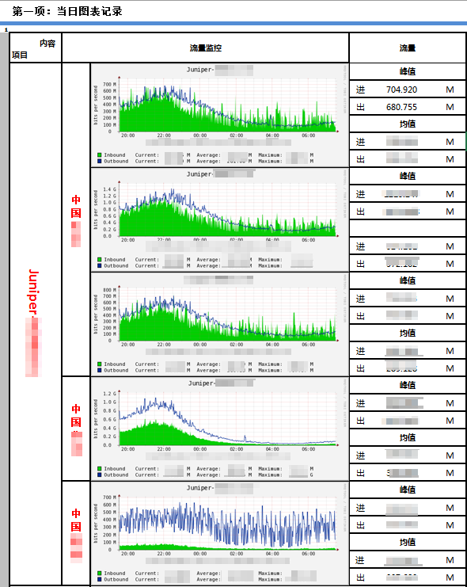

idc每日流量报表生成(excel)
-------------

###获取rrd文件

脚本 `getrrd.sh`通过`wget`和`rsync`（需预先配置好keyAuthentication）来获取 rrd 文件。

###绘图

采用rrdtool来绘制流量图，
同时`rrdtool graph PRINT`的输出流量值，均已*Mbps*为单位，保留三位小数。

###发送文件到用户组

发送前需将流量值文件格式化输出，简单的使用`sed`和`awk`就可实现。

mail可使用公司内部 smtp 服务，在 CentOS下配置文件位于`/etc/mailrc`

	#using corp smtp services
	set from=admin@corp.name.com smtp=smtp://mail.corp.name.com:25
	set smtp-auth-user=admin smtp-auth-password=123456 smtp-auth=login

###例行任务

重定向标准输出和错误到指定文件，以下是每隔12小时运行一次

	30 07,19 * * * user bash /home/user/reportscript/allinone.sh >/home/user/reportscript/avemax.dat 2>/home/user/reportscript/error.log

###Excel 宏

在 excel 中启用宏，编辑代码，即可运行。

issues：尝试将多个过程放在一个脚本中通过函数调用，但是 crond 的标准输出为空。

